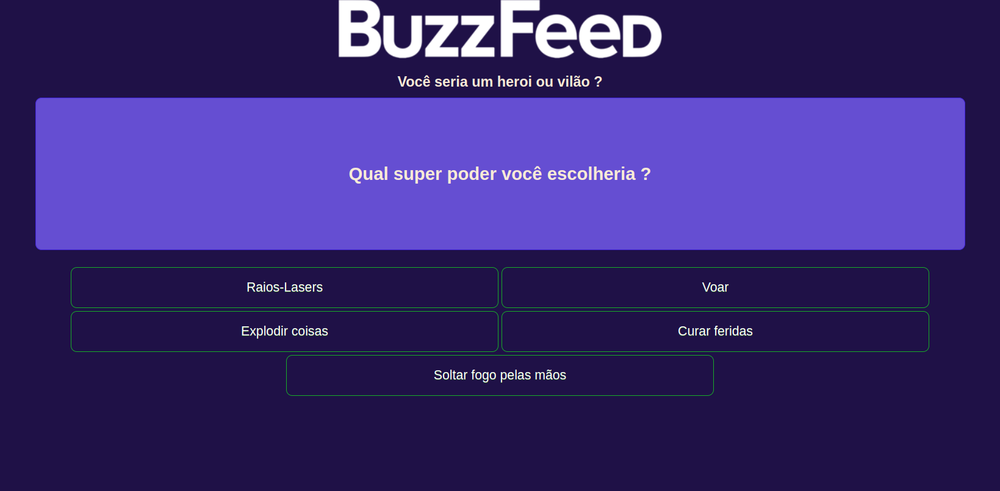

# BuzzfeedClone

This project was generated with [Angular CLI](https://github.com/angular/angular-cli) version 18.0.7.

## Development server

Run `ng serve` for a dev server. Navigate to `http://localhost:4200/`. The application will automatically reload if you change any of the source files.

# Questions

# Result

